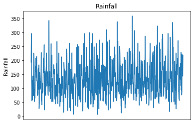
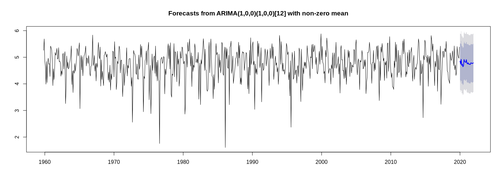
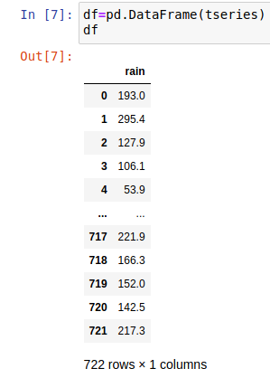
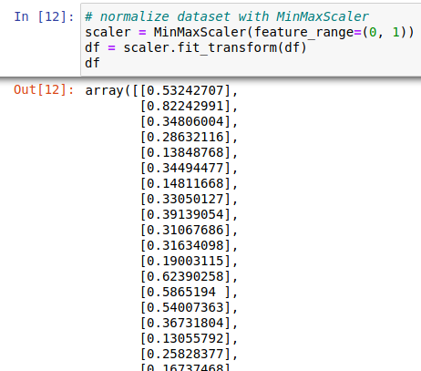
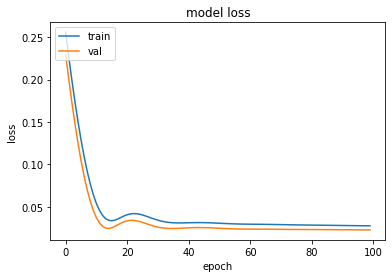
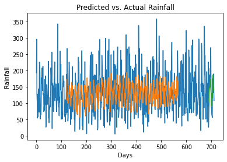

# Modelling Volatile Time Series with LSTM Networks

Here is an illustration of how a long-short term memory network (LSTM) can be used to model a volatile time series.

Yearly rainfall data can be quite volatile. Unlike temperature, which typically demonstrates a clear trend through the seasons, rainfall as a time series can be quite volatile. In Ireland, it is not uncommon for summer months to see as much rain as that of winter months.

Here is a graphical illustration of rainfall patterns from November 1959 for Newport, Ireland:



Using a standard ARIMA model on volatile data such as this is typically not sufficient, as the inherent volatility in the series leads to wide confidence intervals in the forecast.



However, as a sequential neural network, LSTM models can prove superior in accounting for the volatility in a time series.

## Data Manipulation and Model Configuration

The dataset in question comprises of 722 months of rainfall data.

712 data points are selected for training and validation purposes, i.e. to build the LSTM model. Then, the last 10 months of data are used as test data to compare with the predictions from the LSTM model.

Here is a snippet of the dataset:



A dataset matrix is then formed in order to regress the time series against past values:

```
# Form dataset matrix
def create_dataset(df, previous=1):
    dataX, dataY = [], []
    for i in range(len(df)-previous-1):
        a = df[i:(i+previous), 0]
        dataX.append(a)
        dataY.append(df[i + previous, 0])
    return np.array(dataX), np.array(dataY)
```

The data is then normalized with MinMaxScaler:



With the *previous* parameter set to 120, the training and validation datasets are created. For reference, *previous = 120* means that the model is using past values from *t - 120* down to *t - 1* to predict the rainfall value at time *t*.

The choice of the *previous* parameter is subject to trial and error, but 120 time periods were chosen to ensure capture of the volatility or extreme values demonstrated by the time series.

```
import tensorflow as tf
from tensorflow.keras import layers
from tensorflow.keras.layers import Dense
from tensorflow.keras.layers import LSTM

# Training and Validation data partition
train_size = int(len(df) * 0.8)
val_size = len(df) - train_size
train, val = df[0:train_size,:], df[train_size:len(df),:]

# Number of previous
previous = 120
X_train, Y_train = create_dataset(train, previous)
X_val, Y_val = create_dataset(val, previous)
```

The inputs are then reshaped to be in the format of *samples, time steps, features*.

```
# reshape input to be [samples, time steps, features]
X_train = np.reshape(X_train, (X_train.shape[0], 1, X_train.shape[1]))
X_val = np.reshape(X_val, (X_val.shape[0], 1, X_val.shape[1]))

# Generate LSTM network
model = tf.keras.Sequential()
model.add(LSTM(4, input_shape=(1, previous)))
model.add(Dense(1))
model.compile(loss='mean_squared_error', optimizer='adam')
history=model.fit(X_train, Y_train, validation_split=0.2, epochs=100, batch_size=448, verbose=2)


# list all data in history
print(history.history.keys())
# summarize history for accuracy
plt.plot(history.history['loss'])
plt.plot(history.history['val_loss'])
plt.title('model loss')
plt.ylabel('loss')
plt.xlabel('epoch')
plt.legend(['train', 'val'], loc='upper left')
plt.show()
```

## Model Training and Prediction

The model is trained across 100 epochs, and a batch size of 712 (equal to the number of data points in the training and validation set) is specified.

Here is a plot of the training vs. validation loss:



A plot of the predicted vs. actual rainfall is also generated:

```
# Plot all predictions
inversetransform, =plt.plot(scaler.inverse_transform(df))
trainpred, =plt.plot(trainpredPlot)
valpred, =plt.plot(valpredPlot)
plt.xlabel('Days')
plt.ylabel('Rainfall')
plt.title("Predicted vs. Actual Rainfall")
plt.show()
```



The prediction results are compared against the validation set on the basis of Mean Directional Accuracy (MDA), root mean squared error (RMSE) and mean forecast error (MFE).

```
>>> def mda(actual: np.ndarray, predicted: np.ndarray):
>>>     """ Mean Directional Accuracy """
>>>     return np.mean((np.sign(actual[1:] - actual[:-1]) == np.sign(predicted[1:] - predicted[:-1])).astype(int))
    
>>> mda(Y_val, predictions)

0.9090909090909091

>>> from sklearn.metrics import mean_squared_error
>>> from math import sqrt
>>> mse = mean_squared_error(Y_val, predictions)
>>> rmse = sqrt(mse)
>>> print('RMSE: %f' % rmse)

RMSE: 47.744200

>>> forecast_error = (predictions-Y_val)
>>> forecast_error
>>> mean_forecast_error = np.mean(forecast_error)
>>> mean_forecast_error

3.5294448852539078
```

## Predicting against test data

While the demonstrated results across the validation set are quite respectable, it is only by comparing the model predictions to the test (or unseen) data that we can be reasonably confident of the LSTM model holding predictive power.

As previously explained, the last 10 months of rainfall data are used as the test set. The LSTM model is then used to predict 10 months ahead, with the predictions then being compared to the actual values.

The obtained results were as follows:

- **MDA:** 0.8
- **RMSE:** 52.22
- **MFE:** 1.92

The MDA dropped slightly to 80%, while RMSE rose to 52.22. However, the MFE dropped to 1.92.

Here is a visual of the predicted vs. actual rainfall trends for the last 10 months:


We can see that the predictions have tracked the actual incidences of rainfall quite closely. Particularly, the last month of actual rainfall came in at 217.3 mm, which is substantially higher than the average of 132.42 mm across all months in the dataset. The LSTM model predicted a value of 226.65 mm for the last month, which illustrates that the model has been quite adept at predicting more extreme values (at least across this dataset for the 10 months provided).

## Conclusion

In this example, you have seen:

- How to prepare data for use with an LSTM model
- Construction of an LSTM model
- How to test LSTM prediction accuracy
- The advantages of using LSTM to model volatile time series

Many thanks for your time, and the associated repository for this example can be found [here](https://github.com/MGCodesandStats/lstm-rainfall).
